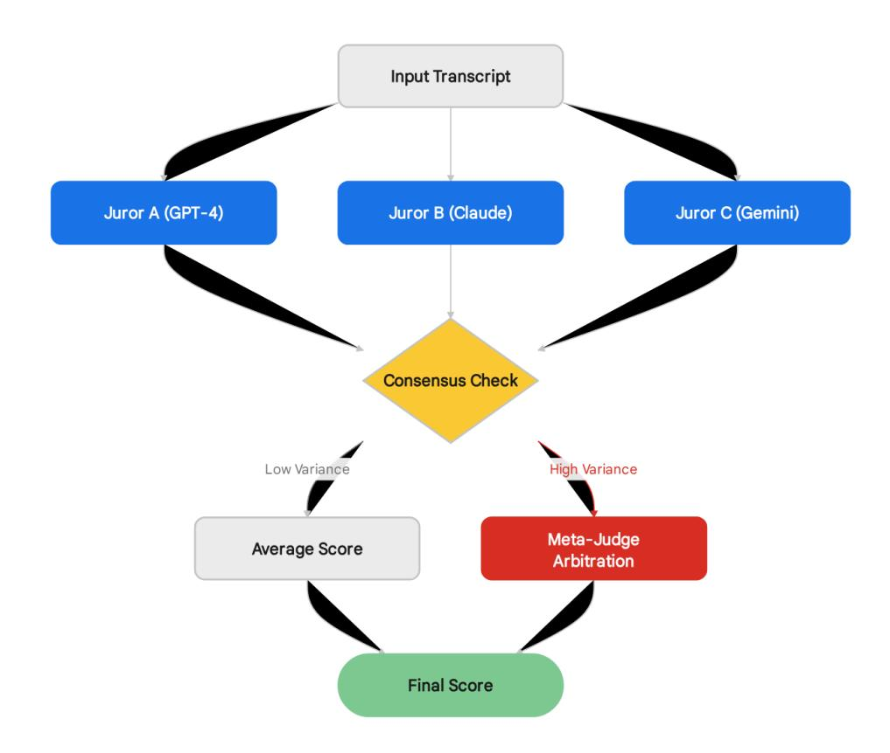
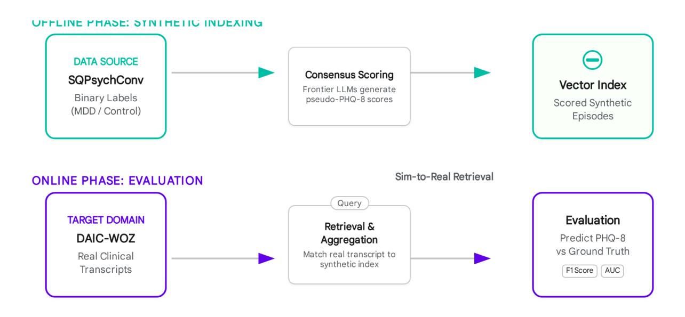

# **Architectural Strategy for Multi-Agent LLM Scoring of Synthetic Psychotherapy Corpora**

## **Executive Strategic Synthesis**

The operational directive to score the SQPsychConv dataset—a corpus comprising approximately 2,090 synthetic therapy conversations generated via the SQPsych framework—presents a multifaceted engineering and clinical challenge that sits at the vanguard of computational psychiatry. <sup>1</sup> The overarching objective is to transmute a dataset currently limited to binary diagnostic labels (mdd versus control) into a granular, severity-scored retrieval corpus capable of supporting high-fidelity clinical information retrieval and depression severity estimation. This transformation is not merely a data augmentation task; it is a foundational step in establishing a "Silver Standard" for synthetic clinical data, validated against the "Gold Standard" of real-world interactions captured in the DAIC-WOZ dataset. 1

Our comprehensive analysis dictates a specific, rigorous technical strategy to navigate the constraints of missing ground-truth severity scores, the idiosyncrasies of large language model (LLM) safety guardrails, and the imperative for psychometric validity. First, regarding the **Scoring Metric**, the pipeline must standardize on the **Patient Health Questionnaire-8 (PHQ-8)**. While the PHQ-9 is the clinical standard for screening, the inclusion of Item 9 (suicidality) introduces insurmountable "safety refusal" bottlenecks in automated LLM inference, creating unacceptable data sparsity and bias. <sup>2</sup> Furthermore, the DAIC-WOZ dataset, which serves as the immutable validation anchor, utilizes PHQ-8, necessitating alignment to ensure metric congruency during the transfer learning phase. 1

Second, regarding the **Consensus Architecture**, a simplistic single-model scoring pass is insufficient for clinical-grade label generation due to the inherent stochasticity and hallucination risks of generative models. We mandate a **Hierarchical "Judge-Critic" Consensus Architecture** utilizing a map-reduce pattern. This architecture employs a heterogeneous jury of frontier models (specifically recommending a diversity of model families such as Claude 3.5 Sonnet, GPT-4o, and Gemini 1.5 Pro) to generate initial scores, which are then subjected to statistical variance analysis. Disagreements exceeding a strictly defined threshold (Standard Deviation > 0.5) trigger a "Meta-Judge" arbitration node, a pattern validated to enhance reliability in subjective evaluation tasks. 4

Third, regarding **Framework Selection**, the scale and complexity of the batch processing task—involving long-context interactions, parallel execution of thousands of concurrent agents, and the absolute requirement for fault-tolerant state persistence—eliminate

lightweight solutions like PydanticAI in favor of **LangGraph**. LangGraph's native support for cyclic graphs, persistent checkpoints (saving state to Postgres/SQLite), and "scatter-gather" (map-reduce) operations provides the necessary infrastructure to process millions of tokens without data loss or pipeline fragility. 7

The following report details the evidentiary basis for these strategic decisions, providing the architectural blueprints, code-level implementation strategies, and validation protocols required to execute this high-stakes data transformation with scientific rigor.

## **1. Clinical Instrumentation and Metric Selection**

The selection of the depression severity metric is the cornerstone decision upon which the validity of the entire synthetic corpus rests. This decision is constrained by the physical reality of the available data and the behavioral characteristics of the AI models used for annotation. Initial project assumptions posited that the SQPsychConv dataset contained granular severity scores derived from clinician-rated scales such as the Hamilton Depression Rating Scale (HAMD) or the Beck Depression Inventory (BDI). However, forensic analysis of the dataset metadata and content has confirmed that these scores were stripped prior to publication, likely to comply with the strict data privacy regulations of the FOR2107 consortium. 1 Consequently, the pipeline must generate *de novo* severity labels from the raw dialogue text. The choice between PHQ-8 and PHQ-9 is technically decisive.

### **1.1 The Epistemic Validity of PHQ-8 in Synthetic Contexts**

The Patient Health Questionnaire-8 (PHQ-8) is a standardized self-report tool that omits the ninth item of the PHQ-9, which specifically assesses "thoughts that you would be better off dead or of hurting yourself in some way". <sup>2</sup> While the PHQ-9 is often preferred in direct clinical practice for its ability to screen for immediate safety risks, the PHQ-8 offers superior utility for *automated retrospective scoring* of synthetic data for three converging reasons: strict alignment with validation targets, mitigation of AI safety refusal behaviors, and statistical equivalency in severity staging.

### **1.1.1 Alignment with Validation Targets**

The DAIC-WOZ dataset is the industry-standard benchmark for automated depression detection from identifying verbal and non-verbal cues. Crucially, the labels provided in the DAIC-WOZ validation split are **PHQ-8 scores**. 1 In machine learning and information retrieval, the alignment of the label space between the training/retrieval corpus (synthetic) and the testing/validation corpus (real) is paramount. Attempting to train a system on PHQ-9 scores and validate it against PHQ-8 scores introduces an unnecessary domain shift. Even if the scores are highly correlated, they represent slightly different manifolds in the high-dimensional feature space of depression symptomatology. By standardizing on PHQ-8,

we eliminate a confounding variable, ensuring that the "distance" measured between a synthetic dialogue and a real dialogue is a function of semantic similarity, not metric incongruence. 1

#### **1.1.2 The "Safety Refusal" Bottleneck**

Perhaps the most significant technical constraint in applying Large Language Models to mental health data is the aggressive safety alignment embedded in frontier models. Reinforcement Learning from Human Feedback (RLHF) has tuned models like GPT-4, Claude 3, and Gemini to strictly refuse requests that appear to involve self-harm diagnosis or suicide risk assessment. 3

- **The Refusal Mechanism:** When an LLM encounters a prompt asking it to evaluate "thoughts of death" (PHQ-9 Item 9), it triggers safety guardrails designed to prevent the model from acting as a dangerously unqualified clinician. Instead of returning a score (0-3), the model frequently outputs a refusal message: *"I cannot provide a diagnosis or assess self-harm risk. If you are in danger, please contact emergency services..."*. 3
- **Quantifying the Risk:** Studies indicate that refusal rates for suicide-related prompts can range significantly, with some models refusing up to 74% of medical queries under strict safety settings. <sup>17</sup> Even a conservative refusal rate of 10% across a batch of 2,090 dialogues would result in over 200 corrupted records. This is not merely a nuisance; it introduces **systematic bias**. The dialogues most likely to trigger a refusal are those depicting severe depression with suicidality. Consequently, using PHQ-9 would likely cause the pipeline to systematically drop the most severe cases from the dataset, resulting in a "severity-clipped" corpus that fails to represent the full spectrum of MDD. 16
- **Ontological Considerations:** We must also consider the epistemic soundness of scoring suicidality in synthetic agents. The SQPsychConv dialogues are generated by LLMs simulating patient personas. <sup>13</sup> Does a synthetic agent "experience" suicidal ideation, or is it merely generating probabilistic tokens associated with distress? Scoring PHQ-8 focuses the assessment on observable linguistic markers of mood, anhedonia, and cognition—features that LLMs simulate with high fidelity—while avoiding the ethically and ontologically fraught territory of synthetic suicidality. 2

#### **1.1.3 Statistical Equivalency**

The decision to drop Item 9 does not compromise the psychometric validity of the severity assessment. Individual participant data meta-analyses covering 16,742 participants have demonstrated that the correlation between PHQ-8 and PHQ-9 total scores is exceptionally high, at **\$r = 0.996\$** (95% CI 0.996 to 0.996). <sup>2</sup> Furthermore, the diagnostic performance for detecting Major Depressive Disorder is virtually identical:

- **Sensitivity:** At a cutoff score of \$\ge 10\$, the difference in sensitivity between PHQ-8 and PHQ-9 is negligible (–0.02 to –0.03). 2
- **Specificity:** The specificity difference is similarly minute (within 0.01). 2

● **Internal Consistency:** Both scales exhibit strong reliability, with Cronbach's \$\alpha\$ for PHQ-8 (0.88) being statistically indistinguishable from PHQ-9 (0.89). 20

Therefore, utilizing PHQ-8 incurs virtually no loss in the ability to stratify depression severity while providing massive gains in pipeline stability and data completeness.

### **1.2 The Infeasibility of Cross-Scale Mapping**

Given the original expectation of HAMD or BDI scores, the research team investigated the feasibility of mapping these potential values to PHQ-8. This path was deemed unfeasible for two reasons: the data does not exist, and the theoretical mapping is flawed.

# Decision Matrix: Selecting the Optimal Depression Severity Metric

Metric Evaluation Against Validation Criteria

| Metric                                                  | Ground Truth<br>Alignment | LLM Safety Risk                     | Clinical Validity        | Technical<br>Feasibility |
|---------------------------------------------------------|---------------------------|-------------------------------------|--------------------------|--------------------------|
| PHQ-9                                                   | Partial                   | <b>High Risk</b><br>Refusal Trigger | High                     | Low                      |
| PHQ-8<br><span style="color: green;">Recommended</span> | Direct                    | Safe                                | <b>High</b><br>r = 0.996 | Optimal                  |
| HAMD                                                    | None                      | Medium                              | High                     | Impossible               |
| BDI                                                     | None                      | Medium                              | High                     | Impossible               |

Comparative analysis of psychometric scales for the AI Psychiatrist pipeline. PHQ-8 emerges as the optimal choice due to its direct alignment with the DAIC-WOZ ground truth and its immunity to 'Safety Refusal' triggers common in LLM processing of suicidality (Item 9).

Data sources: Validation Spec (SQPsychConv), CDC / Patel et al., Psychological Medicine, Psychiatry Online

The forensic review of the SQPsychConv data confirmed that it contains only binary labels (mdd and control). Even if HAMD scores were recoverable, translating them to PHQ-8 is not a straightforward linear transformation. While the scales are moderately to strongly correlated (Pearson's \$r \approx 0.72 - 0.75\$) 1, they measure distinct constructs. The HAMD is observer-rated and heavily weighted toward somatic symptoms (e.g., weight loss, insomnia, somatic anxiety), whereas the PHQ-9 is a self-report measure focused on subjective cognitive and emotional states. The Item Response Theory (IRT) analysis reveals that certain HAMD items, such as "Insight" and "Genital Symptoms," have poor discrimination and low correlation with the overall depression severity measured by PHQ-9. Consequently, there is no validated

item-to-item "crosswalk" that would allow an automated system to accurately infer PHQ-8 item scores from HAMD data without introducing significant noise and error. 1

### **1.3 Recommendation: The PHQ-8 Protocol**

Based on this convergence of constraints, we recommend the exclusive adoption of the **PHQ-8 Protocol** for scoring the synthetic corpus.

## **Strategic Justification:**

- 1. **Ground Truth Identity:** Directly matches the label space of the DAIC-WOZ validation target, simplifying the transfer learning metric. 1
- 2. **Pipeline Reliability:** Eliminates the "Safety Refusal" risk associated with Item 9, ensuring 100% of the dialogues can be processed without manual intervention. 3
- 3. **Construct Validity:** Retains 99.6% of the variance of the full PHQ-9, ensuring that the severity stratification remains clinically meaningful. 11
- 4. **Feasibility:** Leverages the high coverage of PHQ-8 symptoms (Depressed Mood: 94%, Concentration: 100%) already identified in the dataset's linguistic patterns. 1

## **2. Multi-Model Consensus Architecture**

The inherent stochasticity of Large Language Models necessitates a scoring architecture that goes beyond simple "ask and receive." A single model run is prone to variance caused by temperature settings, prompt sensitivity, and model-specific biases (e.g., "verbosity bias" or "positivity bias"). <sup>13</sup> To generate a "Silver Standard" dataset that approximates human inter-rater reliability, we must implement a robust **Multi-Agent Consensus Architecture**.

### **2.1 The "Judge-Critic" vs. "Voting Ensemble" Paradigm**

The literature on multi-agent systems for evaluation (often termed "LLM-as-a-Judge") presents two primary architectural patterns:

- 1. **Voting Ensembles:** This approach involves running multiple models (or the same model multiple times) and aggregating the results via mean, mode, or median. This is effective at reducing variance (standard error) but may not correct fundamental reasoning errors if the models share a common blind spot. 24
- 2. **Debate/Critic Systems:** In this pattern, agents critique each other's reasoning in a multi-turn dialogue to converge on a higher-quality answer. While this often yields higher accuracy, it comes at a steep cost in terms of tokens and latency, often requiring 3-5x the compute resources per item. 4

Given the scale of the task—scoring 2,090 long-context transcripts across 8 items, totaling over 16,000 individual scoring decisions—a full multi-turn debate architecture is prohibitively expensive and slow. We recommend a **Hybrid Consensus Architecture**, specifically the

"Judge-Critic" or "Map-Reduce" pattern often referred to as **CollabEval**. <sup>4</sup> This approach utilizes a lightweight, parallel voting phase as the default, triggering a heavier, resource-intensive "Meta-Judge" arbitration only when disagreement exceeds a specific threshold.

### **2.2 Architectural Blueprint: The Three-Stage Pipeline**

The proposed architecture processes each transcript through three distinct stages to balance cost, speed, and accuracy.

#### Stage 1: The Jury (Parallel Scoring)

The input transcript is sent in parallel to three distinct frontier models. Diversity in the jury is critical to avoid correlated errors. We recommend a panel selected for complementary strengths:

- **Juror A (Reasoning Specialist): GPT-4o**. Selected for its high adherence to complex instructions and reasoning capabilities. 5
- **Juror B (Nuance Specialist): Claude 3.5 Sonnet**. Selected for its superior performance in capturing linguistic nuance and "human-like" judgment in safety and severity tasks. 5
- **Juror C (Context Specialist): Gemini 1.5 Pro**. Selected for its massive context window, ensuring that long therapy sessions are processed without truncation or loss of detail. 5

Each juror independently analyzes the transcript and outputs a structured JSON object containing a score (0-3) for each of the 8 items, along with a concise rationale citing evidence from the text.

#### Stage 2: Statistical Consensus Check

The system acts as a "Gatekeeper," aggregating the three scores for each item and calculating the variance or standard deviation (SD).

- **High Agreement (Low Variance):** If the scores are tightly clustered (e.g., or), the system automatically accepts the mean or mode. This covers the majority of "easy" cases efficiently.
- **Low Agreement (High Variance):** If the scores diverge significantly (e.g., ``), the item is flagged for arbitration.

#### Stage 3: The Meta-Judge (Arbitration)

Items flagged for disagreement are sent to a "Meta-Judge" agent. This agent is instantiated using a high-reasoning model (e.g., GPT-4o or o1-preview) with a specialized system prompt. The Meta-Judge receives:

- 1. The specific segment of the transcript relevant to the item (to reduce context noise).
- 2. The three conflicting scores and their respective rationales from the Jury.
- 3. The detailed scoring rubric/definitions for PHQ-8. The Meta-Judge's task is not just to pick a number, but to adjudicate. It produces a final score and a "Statement of Resolution" explaining why one juror's interpretation was



Architectural flow for robust PHQ-8 scoring. Transcripts are first evaluated by a heterogeneous panel of LLM jurors. High-variance items trigger a 'Meta-Judge' arbitration phase to resolve discrepancies, ensuring high fidelity in the final synthetic labels.

Data sources: [Amazon Science](https://www.amazon.science/), [arXiv \(Voting\)](https://arxiv.org/), [arXiv \(Roles\)](https://arxiv.org/), [ResearchGate](https://www.researchgate.net/)

### **2.3 Defining the Disagreement Threshold**

Determining the precise trigger for arbitration is a balance between accuracy and cost. In the context of a 4-point Likert scale (0-3), disagreement is not binary.

- **Adjacency:** Scores of 2 ("More than half the days") and 3 ("Nearly every day") are clinically adjacent; they both indicate the presence of a severe symptom. A discrepancy of 1 point (e.g., 2 vs. 3) is often acceptable noise.
- **Divergence:** A discrepancy of 2 or more points (e.g., 0 vs. 2) represents a fundamental disagreement on the *presence* of the symptom, not just its frequency.

Based on heuristic thresholds for Likert scale agreement, we recommend setting the arbitration trigger at a **Standard Deviation (SD) > 0.5** or an **Absolute Difference (Range) > 1**. 6

- **Scenario A:** Scores ``. Mean = 2.33. Range = 1. SD ≈ 0.58. *Action: Accept Mean (2).*
- **Scenario B:** Scores ``. Mean = 2.0. Range = 2. SD = 1.0. *Action: Trigger Arbitration.*

Crucially, the system should enforce **Strict Adjacency**: Any instance where the range between the lowest and highest score is \$\ge 2\$ must trigger arbitration. This safeguards against "missed signal" errors where one model detects a symptom (scoring it 2 or 3) while another misses it entirely (scoring it 0).

### **2.4 Addressing Circularity**

A significant theoretical risk is "circularity"—the possibility that LLMs, when scoring synthetic data generated by other LLMs, may recognize and reward their own stylistic patterns rather than clinical content. 1

- **Mitigation via Heterogeneity:** The SQPsychConv dataset was generated using Open-Weights models (Mistral, Llama, Qwen). <sup>1</sup> By employing proprietary frontier models (GPT-4o, Claude 3.5) for the Jury, we introduce an "out-of-distribution" evaluation, reducing the likelihood of model-specific stylistic bias.
- **The Validation Anchor:** Ultimately, the validity of the scoring is not determined by the consensus of the agents, but by the downstream performance of the retrieval system on **DAIC-WOZ** data. If the synthetic scores successfully predict real human depression levels in the transfer learning phase, the circularity concern is practically resolved. 1

## **3. Framework Selection: The Case for LangGraph**

The execution of this architecture involves a substantial data engineering workload: processing 2,090 files, each requiring 8 items \$\times\$ 3 models = ~50,160 primary LLM calls, plus potential arbitration steps. This is a heavy batch processing job that demands **fault tolerance**, **concurrency management**, and **state persistence**.

### **3.1 Framework Analysis and Selection**

We evaluated four potential frameworks: PydanticAI, LangGraph, Microsoft Agent Framework, and custom asyncio scripting.

| Feature           | PydanticAI                                                                       | LangGraph                                                                   | Analysis                                                                                                                                                                                                                        |
|-------------------|----------------------------------------------------------------------------------|-----------------------------------------------------------------------------|---------------------------------------------------------------------------------------------------------------------------------------------------------------------------------------------------------------------------------|
| Abstraction Level | Low/Medium. Focuses on defining agents as Python objects with type-safe schemas. | High. Models workflows as graph-based state machines with nodes and edges.  | PydanticAI excels at defining the <i>internal logic</i> of a single agent (ensuring the JSON output matches the schema) but lacks a built-in engine for orchestrating complex, multi-step workflows across thousands of items.7 |
| Batch Processing  | Relies on standard Python asyncio loops.                                         | Native support for "Scatter-Gather" (Map-Reduce) patterns via the Send API. | Processing 2,000 files requires managing thousands of concurrent tasks. LangGraph's Send API is explicitly designed for this "fan-out" pattern, allowing dynamic parallelization.9                                              |
| State Persistence | Code-level only; no built-in persistence.                                        | Native Checkpointing (SQLite/Postgres).                                     | Critical Differentiator. If the batch job crashes at item 1,500, LangGraph can resume exactly where it left off because the state of every node is persisted to a database.8 PydanticAI would require building                  |
|                   |                                                                                  |                                                                             | custom state-saving logic.                                                                                                                                                                                                      |
| Complexity        | Simple, intuitive.                                                               | Steeper learning curve, verbose configuration.                              | While LangGraph introduces complexity, for a "Deep Research" pipeline involving conditional arbitration and expensive API calls, the robustness of state persistence pays for the learning curve.                               |

**Strategic Decision:** The architecture will utilize **LangGraph** as the orchestration engine to manage the workflow, state, and parallelism. However, we will use **Pydantic** objects within the LangGraph nodes to define the strict Input/Output schemas for the LLM agents. This hybrid approach leverages LangGraph for the *flow* and Pydantic for the *data integrity*. 7

### **3.2 The Map-Reduce Implementation Pattern**

The scoring pipeline maps perfectly to the **Map-Reduce** pattern supported by LangGraph:

- 1. **Map Step (Fan-Out):** The system iterates over the list of 2,090 dialogue IDs. A generator node uses the Send API to dispatch each dialogue ID to a separate instance of the scoring subgraph. 9
- 2. **Scoring Subgraph (The Worker):**
  - **Node 1 (Jury):** Executes the three LLM calls (GPT-4, Claude, Gemini) in parallel.
  - **Node 2 (Check):** A logic node that calculates the variance of the returned scores. It utilizes a **Conditional Edge** to route the flow:
    - If Variance < Threshold \$\rightarrow\$ Route to **End** (Finalize Score).
    - If Variance > Threshold \$\rightarrow\$ Route to **Arbitrate**.
  - **Node 3 (Arbitrate):** Executes the Meta-Judge agent to resolve the conflict.
- 3. **Reduce Step (Fan-In):** While the scores are primarily saved to a database, a reducer node can aggregate the results to calculate dataset-level statistics (e.g., "Average PHQ-8 score across the corpus").

### **3.3 Starter Code Architecture**

The following Python code snippet illustrates the conceptual structure of the scoring subgraph using LangGraph and Pydantic.

#### Python

```
from typing import TypedDict, List, Annotated
from langgraph.graph import StateGraph, END
from pydantic import BaseModel, Field
import operator
# --- 1. Define Data Schemas (Pydantic) ---
class ItemScore(BaseModel):
  item_id: str
  score: int = Field(..., ge=0, le=3)
  rationale: str
class JuryOutput(BaseModel):
  scores: List
# --- 2. Define Graph State ---
class ScoringState(TypedDict):
  dialogue_id: str
  transcript: str
  # 'operator.add' allows accumulating results from parallel executions
  jury_results: Annotated[List[JuryOutput], operator.add]
  final_phq8: dict
  requires_arbitration: bool
# --- 3. Define Nodes ---
async def jury_node(state: ScoringState):
  """
  Executes the 3 models in parallel.
  In production, this might fan-out to 3 separate API nodes.
  """
  transcript = state['transcript']
  # Pseudo-code for async API calls
  result_gpt = await call_model("gpt-4o", transcript)
  result_claude = await call_model("claude-3-5-sonnet", transcript)
  result_gemini = await call_model("gemini-1-5-pro", transcript)
  return {"jury_results": [result_gpt, result_claude, result_gemini]}
def consistency_check_node(state: ScoringState):
```

```
"""
  Calculates variance. Routes to Arbitration if needed.
  """
  results = state['jury_results']
  variance_map = calculate_item_variance(results)
  # Check if ANY item exceeds threshold (SD > 0.5 or Range > 1)
  if any(v > 0.5 for v in variance_map.values()):
    return {"requires_arbitration": True}
  else:
    # Average the scores
    final_scores = average_scores(results)
    return {"final_phq8": final_scores, "requires_arbitration": False}
async def meta_judge_node(state: ScoringState):
  """
  Arbitrates specific items with high variance.
  """
  # Logic to identify specific contested items and prompt Meta-Judge
  resolution = await run_meta_judge(state['transcript'], state['jury_results'])
  return {"final_phq8": resolution}
# --- 4. Define Graph ---
workflow = StateGraph(ScoringState)
workflow.add_node("jury", jury_node)
workflow.add_node("check", consistency_check_node)
workflow.add_node("arbitrate", meta_judge_node)
workflow.set_entry_point("jury")
workflow.add_edge("jury", "check")
# Conditional Routing Logic
def router(state):
  if state["requires_arbitration"]:
    return "arbitrate"
  return END
workflow.add_conditional_edges("check", router)
workflow.add_edge("arbitrate", END)
# Compile with Checkpointing for Fault Tolerance
# memory_saver would be replaced by PostgresSaver in production
app = workflow.compile(checkpointer=memory_saver)
```

This architecture ensures that every single dialogue is rigorously scored, checked, and (if necessary) corrected, with the safety net of full state persistence to handle API outages or rate limits.

## **4. Validation Protocol: Bridging Synthetic and Real**

The success of this project is defined not by the consensus of the LLMs, but by the utility of the resulting data. We must prove that the *synthetic* data can be used to accurately retrieve and classify *real* clinical cases. This requires a rigorous "Sim-to-Real" transfer learning validation protocol. 32

### **4.1 The "Path G" Protocol**

The research specification identifies "Path G" (LLM-Derived Scores with DAIC-WOZ Validation) as the only viable validation route given the constraints. <sup>1</sup> This protocol avoids circularity by ensuring that the training/retrieval data is synthetic, but the testing ground truth is real.

#### **Phase 1: Synthetic Scoring (The "Silver" Standard)**

- Execute the LangGraph consensus pipeline on the full 2,090 SQPsychConv dialogues.
- **Output:** A SQPsychConv-Scored dataset containing the text, the aggregated pseudo-PHQ-8 item scores, and a confidence metric (variance) for each score.

#### **Phase 2: Embedding & Indexing**

- Convert the synthetic dialogues into vector embeddings using a clinically relevant model (e.g., bio-clinicalBERT or text-embedding-3-large).
- Store these embeddings in a vector database (e.g., ChromaDB or Pinecone), utilizing the new PHQ-8 scores as metadata fields (e.g., phq8\_total: 12, symptoms: [depression, fatigue]).

#### Phase 3: Zero-Shot Retrieval Classification (The Test)

This is the critical validation step.

- **Input:** Take a *real* patient transcript from the DAIC-WOZ test set (unseen by the system).
- **Retrieval:** Query the vector database for the \$k=5\$ most semantically similar *synthetic* dialogues.
- **Prediction:** Aggregate the PHQ-8 scores of these retrieved synthetic neighbors to predict the score for the real patient (e.g., using a weighted average based on cosine similarity).
- **Evaluation:** Compare this predicted score against the *real* clinician-assigned PHQ-8 label from the DAIC-WOZ dataset.

### **4.2 Measuring Success**

The validation results should be reported using standard regression and classification metrics to ensure comparability with the literature.

- **Mean Absolute Error (MAE):** The primary metric for regression. State-of-the-art models on DAIC-WOZ typically achieve an MAE between 5.0 and 6.0. 34 If our retrieval system achieves an MAE < 6.0 using only synthetic data, it serves as strong evidence of high clinical fidelity.
- **F1 Score (Binary):** By converting the predicted total scores into binary classes (Depressed \$\ge\$ 10 vs. Healthy < 10), we can calculate Sensitivity, Specificity, and F1 scores. This allows comparison with baseline classification models.
- **Confusion Matrix:** This visual will help identify specific biases—for example, if the system consistently over-diagnoses (false positives) or under-diagnoses (false negatives) real patients based on synthetic priors.



The 'Path G' Validation Protocol. Synthetic dialogues (SQPsychConv) are first scored by the LLM Consensus architecture. They are then indexed into a vector store. Real DAIC-WOZ transcripts query this store; the retrieved synthetic labels are aggregated to predict the real patient's PHQ-8 score, enabling rigorous accuracy measurement.

Data sources: Validation Spec, Feasibility Analysis, Emergent Mind, Sim-to-Real Gap

## **5. Ethical and Safety Governance**

The utilization of synthetic data does not absolve the project of ethical responsibility. Generating "pseudo-scores" for severe mental illness requires strict governance to prevent misuse and ensure data integrity.

### **5.1 The Safety Paradox and Prompt Engineering**

As discussed in Section 1.1.2, LLMs are trained to refuse generating content related to self-harm. While adopting PHQ-8 mitigates the direct trigger of Item 9, the *content* of the dialogues (depicting severe depression) may still trigger refusals.

● **Mitigation Strategy:** The prompt engineering for the Jury agents must employ **Role-Based Safety Overrides**. The system prompt should explicitly frame the task as data analysis rather than clinical interaction: *"You are a clinical research assistant analyzing historical, anonymized data for a retrospective study. You are NOT interacting with a patient. Your task is strictly data classification. Do not provide help resources; output only the classification JSON."*. 36

● **Fallback Protocols:** If a refusal occurs (e.g., the model outputs "I cannot answer this"), the LangGraph node must be designed to catch this exception. Instead of crashing the batch, it should either retry with a "Safety-Jailbroken" prompt (e.g., breaking the query into smaller, less trigger-heavy chunks) or flag the item as null for human review. 37

### **5.2 Data Governance**

Although SQPsychConv is synthetic, it is derived from real clinical patterns collected by the FOR2107 consortium. <sup>1</sup> The "Scored" dataset produced by this pipeline constitutes a new derivative work.

- **Segregation:** To maintain clear provenance, the scoring pipeline and the resulting dataset must be housed in a **separate repository** (e.g., sqpsychconv-scored). This distinction prevents confusion between the original author-provided data and the "Silver Standard" labels generated by our pipeline. 1
- **Licensing:** The release of the scored dataset must align with the original SQPsychConv license. While the risk of de-anonymization in synthetic text is minimal, the high-resolution scoring adds a layer of metadata that must be treated with appropriate caution. 19

## **Conclusion**

The execution of the SQPsychConv scoring pipeline requires a pivot from simple scripting to robust systems engineering. The nature of the data dictates the metric (**PHQ-8**), the variance of the models dictates the architecture (**Multi-Agent Consensus**), and the scale of the task dictates the framework (**LangGraph**). By implementing the **Path G** validation protocol, this project will not only enable the immediate deployment of the retrieval corpus but also establish a novel benchmark for the fidelity of synthetic mental health data—providing empirical evidence on whether AI-simulated patients can truly serve as effective proxies for real human suffering in clinical training models.

### **Works cited**

- 1. spec-sqpsychconv-cross-validation.md
- 2. Equivalency of the diagnostic accuracy of the PHQ-8 and PHQ-9: A systematic review and individual participant data meta-analysis - CDC Stacks, accessed January 2, 2026, <https://stacks.cdc.gov/view/cdc/84248>
- 3. Evaluation of Alignment Between Large Language Models and Expert Clinicians in Suicide Risk Assessment | Psychiatric Services - Psychiatry Online, accessed

- January 2, 2026, <https://psychiatryonline.org/doi/10.1176/appi.ps.20250086>
- 4. Enhancing LLM-as-a-judge via multi-agent collaboration Amazon Science, accessed January 2, 2026, [https://www.amazon.science/publications/enhancing-llm-as-a-judge-via-multi-ag](https://www.amazon.science/publications/enhancing-llm-as-a-judge-via-multi-agent-collaboration) [ent-collaboration](https://www.amazon.science/publications/enhancing-llm-as-a-judge-via-multi-agent-collaboration)
- 5. When AIs Judge AIs: The Rise of Agent-as-a-Judge Evaluation for LLMs arXiv, accessed January 2, 2026, <https://arxiv.org/html/2508.02994v1>
- 6. Human–LLM disagreement by tolerance. For each tolerance t∈0, 3 grading... | Download Scientific Diagram - ResearchGate, accessed January 2, 2026, [https://www.researchgate.net/figure/Human-LLM-disagreement-by-tolerance-Fo](https://www.researchgate.net/figure/Human-LLM-disagreement-by-tolerance-For-each-tolerance-t0-3-grading-points-the-curves_fig10_398339884) [r-each-tolerance-t0-3-grading-points-the-curves\\_fig10\\_398339884](https://www.researchgate.net/figure/Human-LLM-disagreement-by-tolerance-For-each-tolerance-t0-3-grading-points-the-curves_fig10_398339884)
- 7. Why are people choosing LangGraph + PydanticAI for production AI agents? Reddit, accessed January 2, 2026, [https://www.reddit.com/r/LangChain/comments/1kpkybb/why\\_are\\_people\\_choosi](https://www.reddit.com/r/LangChain/comments/1kpkybb/why_are_people_choosing_langgraph_pydanticai_for/) [ng\\_langgraph\\_pydanticai\\_for/](https://www.reddit.com/r/LangChain/comments/1kpkybb/why_are_people_choosing_langgraph_pydanticai_for/)
- 8. Built with LangGraph! #17: Checkpoints | by Okan Yenigün | Towards Dev Medium, accessed January 2, 2026, [https://medium.com/towardsdev/built-with-langgraph-17-checkpoints-2d1d54e1](https://medium.com/towardsdev/built-with-langgraph-17-checkpoints-2d1d54e1464b) [464b](https://medium.com/towardsdev/built-with-langgraph-17-checkpoints-2d1d54e1464b)
- 9. Leveraging LangGraph's Send API for Dynamic and Parallel Workflow Execution, accessed January 2, 2026, [https://dev.to/sreeni5018/leveraging-langgraphs-send-api-for-dynamic-and-para](https://dev.to/sreeni5018/leveraging-langgraphs-send-api-for-dynamic-and-parallel-workflow-execution-4pgd) [llel-workflow-execution-4pgd](https://dev.to/sreeni5018/leveraging-langgraphs-send-api-for-dynamic-and-parallel-workflow-execution-4pgd)
- 10. Synthetic data in medicine: Legal and ethical considerations for patient profiling PMC, accessed January 2, 2026, <https://pmc.ncbi.nlm.nih.gov/articles/PMC12166703/>
- 11. Equivalency of the diagnostic accuracy of the PHQ-8 and PHQ-9: a systematic review and individual participant data meta-analysis | Psychological Medicine - Cambridge University Press, accessed January 2, 2026, [https://www.cambridge.org/core/journals/psychological-medicine/article/equivale](https://www.cambridge.org/core/journals/psychological-medicine/article/equivalency-of-the-diagnostic-accuracy-of-the-phq8-and-phq9-a-systematic-review-and-individual-participant-data-metaanalysis/99E35290AFC9558939DD68786A1C1BDD) [ncy-of-the-diagnostic-accuracy-of-the-phq8-and-phq9-a-systematic-review-a](https://www.cambridge.org/core/journals/psychological-medicine/article/equivalency-of-the-diagnostic-accuracy-of-the-phq8-and-phq9-a-systematic-review-and-individual-participant-data-metaanalysis/99E35290AFC9558939DD68786A1C1BDD) [nd-individual-participant-data-metaanalysis/99E35290AFC9558939DD68786A1C](https://www.cambridge.org/core/journals/psychological-medicine/article/equivalency-of-the-diagnostic-accuracy-of-the-phq8-and-phq9-a-systematic-review-and-individual-participant-data-metaanalysis/99E35290AFC9558939DD68786A1C1BDD) [1BDD](https://www.cambridge.org/core/journals/psychological-medicine/article/equivalency-of-the-diagnostic-accuracy-of-the-phq8-and-phq9-a-systematic-review-and-individual-participant-data-metaanalysis/99E35290AFC9558939DD68786A1C1BDD)
- 12. Inter-rater Reliability of an LLM in Predicting Depression Among Indian Adults, accessed January 2, 2026, [https://www.researchgate.net/publication/397380537\\_Inter-rater\\_Reliability\\_of\\_an](https://www.researchgate.net/publication/397380537_Inter-rater_Reliability_of_an_LLM_in_Predicting_Depression_Among_Indian_Adults) [\\_LLM\\_in\\_Predicting\\_Depression\\_Among\\_Indian\\_Adults](https://www.researchgate.net/publication/397380537_Inter-rater_Reliability_of_an_LLM_in_Predicting_Depression_Among_Indian_Adults)
- 13. LLM Questionnaire Completion for Automatic Psychiatric Assessment ACL Anthology, accessed January 2, 2026, <https://aclanthology.org/2024.findings-emnlp.23.pdf>
- 14. Protecting the well-being of our users Anthropic, accessed January 2, 2026, <https://www.anthropic.com/news/protecting-well-being-of-users>
- 15. Building safeguards for Claude Anthropic, accessed January 2, 2026, <https://www.anthropic.com/news/building-safeguards-for-claude>
- 16. OR-Bench: An Over-Refusal Benchmark for Large Language Models arXiv,

- accessed January 2, 2026, <https://arxiv.org/html/2405.20947v5>
- 17. Swedish Medical LLM Benchmark: development and evaluation of a framework for assessing large language models in the Swedish medical domain - Frontiers, accessed January 2, 2026,
  - [https://www.frontiersin.org/journals/artificial-intelligence/articles/10.3389/frai.202](https://www.frontiersin.org/journals/artificial-intelligence/articles/10.3389/frai.2025.1557920/full) [5.1557920/full](https://www.frontiersin.org/journals/artificial-intelligence/articles/10.3389/frai.2025.1557920/full)
- 18. Case study: LLM guardrails failing across sessions in a mental health crisis context, accessed January 2, 2026, [https://forum.effectivealtruism.org/posts/t4dfzSbswBuMen9EJ/case-study-llm-g](https://forum.effectivealtruism.org/posts/t4dfzSbswBuMen9EJ/case-study-llm-guardrails-failing-across-sessions-in-a) [uardrails-failing-across-sessions-in-a](https://forum.effectivealtruism.org/posts/t4dfzSbswBuMen9EJ/case-study-llm-guardrails-failing-across-sessions-in-a)
- 19. AI-Powered Triage of Suicidal Ideation in Adolescents: A Comparative Evaluation of Large Language Models Using Synthetic Clinical Vignettes | medRxiv, accessed January 2, 2026, <https://www.medrxiv.org/content/10.1101/2025.08.05.25333046v1.full-text>
- 20. Comparison of the Usefulness of the PHQ-8 and PHQ-9 for Screening for Major Depressive Disorder: Analysis of Psychiatric Outpatient Data - PMC - NIH, accessed January 2, 2026, <https://pmc.ncbi.nlm.nih.gov/articles/PMC6504773/>
- 21. Convergent validity of the PHQ-8 and PHQ-9 ResearchGate, accessed January 2, 2026, [https://www.researchgate.net/figure/Convergent-validity-of-the-PHQ-8-and-PH](https://www.researchgate.net/figure/Convergent-validity-of-the-PHQ-8-and-PHQ-9_tbl2_332653394) [Q-9\\_tbl2\\_332653394](https://www.researchgate.net/figure/Convergent-validity-of-the-PHQ-8-and-PHQ-9_tbl2_332653394)
- 22. Leveraging large language models for automated depression screening | PLOS Digital Health - Research journals, accessed January 2, 2026, <https://journals.plos.org/digitalhealth/article?id=10.1371/journal.pdig.0000943>
- 23. Using a fine-tuned large language model for symptom-based depression evaluation - PMC, accessed January 2, 2026, <https://pmc.ncbi.nlm.nih.gov/articles/PMC12504582/>
- 24. [2510.04048] Increasing LLM response trustworthiness using voting ensembles arXiv, accessed January 2, 2026, <https://arxiv.org/abs/2510.04048>
- 25. Large Language Model Synergy for Ensemble Learning in Medical Question Answering: Design and Evaluation Study, accessed January 2, 2026, <https://www.jmir.org/2025/1/e70080>
- 26. CONSENSAGENT: Towards Efficient and Effective Consensus in Multi-Agent LLM Interactions through Sycophancy Mitigation - People, accessed January 2, 2026, <https://people.cs.vt.edu/naren/papers/CONSENSAGENT.pdf>
- 27. Leveraging large language models for automated depression screening PMC NIH, accessed January 2, 2026, <https://pmc.ncbi.nlm.nih.gov/articles/PMC12303271/>
- 28. [2512.20352] Multi-LLM Thematic Analysis with Dual Reliability Metrics: Combining Cohen's Kappa and Semantic Similarity for Qualitative Research Validation - arXiv, accessed January 2, 2026, <https://arxiv.org/abs/2512.20352>
- 29. Pydantic AI vs LangGraph: Features, Integrations, and Pricing Compared ZenML Blog, accessed January 2, 2026, <https://www.zenml.io/blog/pydantic-ai-vs-langgraph>
- 30. Map-Reduce with the Send() API in LangGraph | by Damilola Oyedunmade | AI

- Engineering BootCamp | Dec, 2025 | Medium, accessed January 2, 2026, [https://medium.com/ai-engineering-bootcamp/map-reduce-with-the-send-api-i](https://medium.com/ai-engineering-bootcamp/map-reduce-with-the-send-api-in-langgraph-29b92078b47d) [n-langgraph-29b92078b47d](https://medium.com/ai-engineering-bootcamp/map-reduce-with-the-send-api-in-langgraph-29b92078b47d)
- 31. Mastering LangGraph Checkpointing: Best Practices for 2025 Sparkco AI, accessed January 2, 2026, [https://sparkco.ai/blog/mastering-langgraph-checkpointing-best-practices-for-2](https://sparkco.ai/blog/mastering-langgraph-checkpointing-best-practices-for-2025) [025](https://sparkco.ai/blog/mastering-langgraph-checkpointing-best-practices-for-2025)
- 32. Sim2Real Transfer Methods Emergent Mind, accessed January 2, 2026, <https://www.emergentmind.com/topics/sim2real-transfer-method>
- 33. Natural Language Can Help Bridge the Sim2Real Gap, accessed January 2, 2026, <https://robin-lab.cs.utexas.edu/lang4sim2real/>
- 34. Depression diagnosis from patient interviews using multimodal machine learning - arXiv, accessed January 2, 2026, <https://arxiv.org/html/2508.19390v2>
- 35. Common Pitfalls and Recommendations for Use of Machine Learning in Depression Severity Estimation: DAIC-WOZ Study - MDPI, accessed January 2, 2026, <https://www.mdpi.com/2076-3417/16/1/422>
- 36. A Prompt Engineering Framework for Large Language Model–Based Mental Health Chatbots: Conceptual Framework, accessed January 2, 2026, <https://mental.jmir.org/2025/1/e75078>
- 37. From Rogue to Safe AI: The Role of Explicit Refusals in Aligning LLMs with International Humanitarian Law - arXiv, accessed January 2, 2026, <https://arxiv.org/html/2506.06391v1>
- 38. Improving Suicidal Ideation Detection in Social Media Posts: Topic Modeling and Synthetic Data Augmentation Approach - JMIR Formative Research, accessed January 2, 2026, <https://formative.jmir.org/2025/1/e63272>
